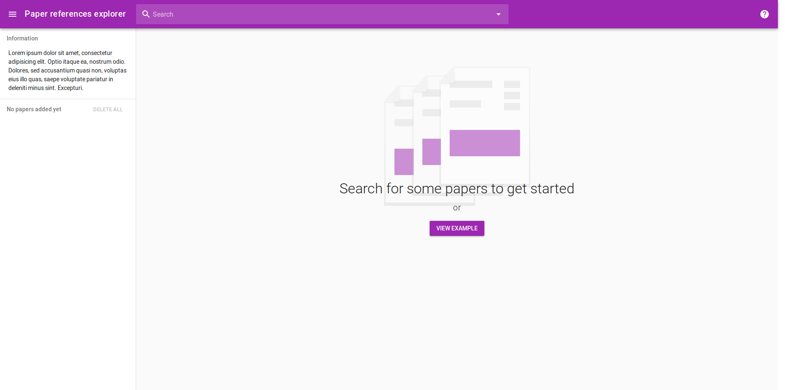

# Paper references explorer
The explorer gives you an overview on all papers your given papers are referencing. 

## How to use?
1. Add a list of papers you want to analyse
2. Get the overview on all the papers your added papers are referencing.

## Features
- number of times a paper was referenced by your paper
- visually highlight papers that are more important for your added papers

## ToDo
- [ ] Setup the backend for the data
- [ ] Style the overview page

## Dev
We are currently building the search index. Instructions on how to add it will follow.

### Docker
#### Setup
Please make sure you have `docker>=18.06.1-ce` and `docker-compose>=1.22.0` installed.

#### Dev
Run `docker-compose -f docker-compose.yml -f docker-compose.dev.yml up`. 
The dev webserver can be reached at [http://localhost:8080](http://localhost:8080).
The file system is mounted into the container, 
which means that the website will be updated automatically on file changes.

#### Prod
Run `docker-compose up`. 
The prod webserver can be reached at [http://localhost:80](http://localhost:80).

### Traditional
#### Setup
Run `yarn` in the project folder. This installs the required dependencies.

#### Dev
For development, run `yarn run dev` in the project folder. 
The dev webserver can be reached at [http://localhost:8080](http://localhost:8080). 

#### Prod
You can create the bundled files by running `yarn build`. 
The generated files will be in `./dist`
